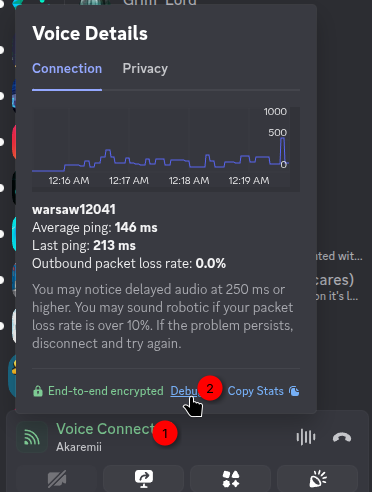
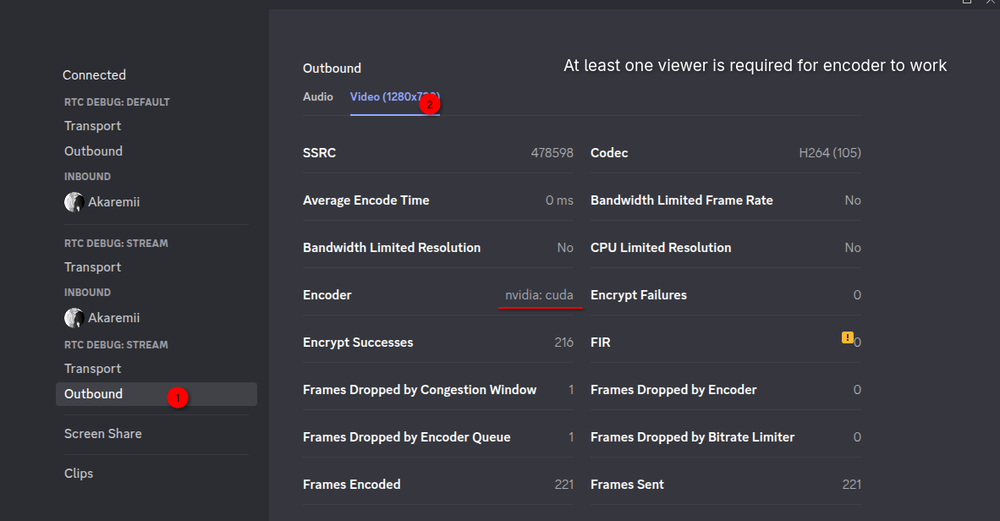

# Enable Vulkan Video/Whatever encoding support in Discord on Linux

TYSM TYSM ZYNIX 💖💖 Huge props to [Zynix](https://github.com/alper-han) for figuring this out.

This patch is especially helpful for people with NVIDIA GPUs which lacks VA-API support.

# How to install

Open up the terminal and run:

```bash
bash <(curl -sL https://raw.githubusercontent.com/relativemodder/discord-linux-vulkan-video-patcher/main/patch.sh)
```

# Result
Smoother picture

# How to check




